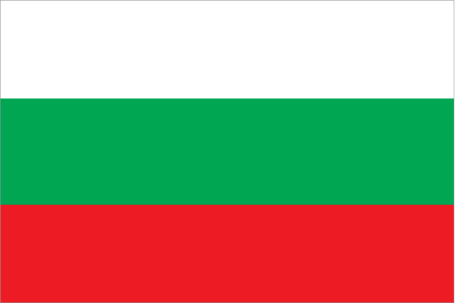
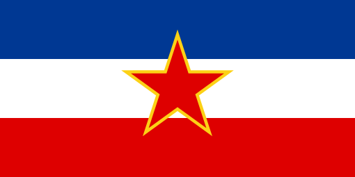

#  Identisio

This project is an attempt to build parsing and validation library for variety of identifiers, such as IBAN, Vat numbers, etc.

## Currently supported identifiers

###  Individuals
 -  Bulgaria
    - EGN ([Единен Граждански Номер, ЕГН](https://bg.wikipedia.org/wiki/%D0%95%D0%B4%D0%B8%D0%BD%D0%B5%D0%BD_%D0%B3%D1%80%D0%B0%D0%B6%D0%B4%D0%B0%D0%BD%D1%81%D0%BA%D0%B8_%D0%BD%D0%BE%D0%BC%D0%B5%D1%80))
    - LNCh (ЛНЧ)
 -  Former Yougoslavian countries
    - JMBG ([ЕМБГ](https://en.wikipedia.org/wiki/Unique_Master_Citizen_Number))
